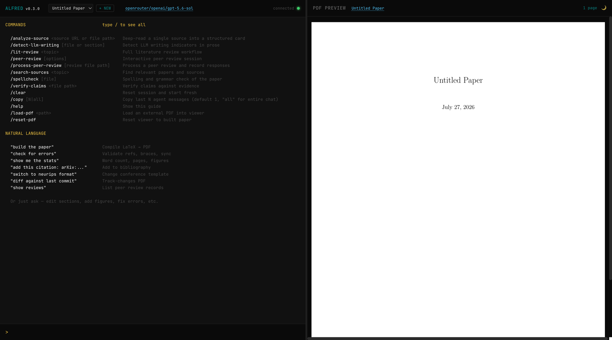

# ALFRED

  

**A**gentic **L**atex **f**or **R**esearch, **E**diting, and **D**rafting.

Clone the repo, point an AI coding agent at it, give it a topic — it writes the paper.



## Features

### Built-in

The agent handles these automatically as part of the writing workflow — just tell it what you want.

- **Conference templates** — 6 formats (NeurIPS, IEEE, ACM, USENIX, ACL, plain article), switch by asking
- **YAML-driven sync** — paper structure defined in `paper.yaml`, agent syncs to `main.tex` automatically
- **PDF build** — compiles LaTeX to `build/main.pdf`
- **Citation management** — searches Semantic Scholar, fetches real BibTeX, adds to `bibliography.bib`
- **Custom macros & styles** — define in `paper.yaml`, auto-generated on sync
- **Validation** — checks refs, markers, braces, sync status before building
- **Statistics** — word count per section, pages, figures, tables, citations
- **Track changes** — diff PDF with additions/deletions highlighted against any git revision
- **PDF dark mode** — toggle for comfortable nighttime reading
- **PDF zoom** — Ctrl/Cmd + scroll to zoom independently of the split pane
- **LaTeX math rendering** — formulas in agent responses render with KaTeX
- **Token usage tracker** — live input/output token counts in the header
- **Workspace mode** — multi-paper support with paper switcher and auto-creation from uploaded PDFs
- **Session persistence** — chat history survives refreshes and reconnects

### Capabilities

Multi-agent workflows you can kick off by asking the agent. These run specialized subagents for research-heavy tasks.

| Capability | What to ask | What it does |
|------------|-------------|--------------|
| Literature review | "Do a lit review on X" | Searches for sources, deep-reads each, synthesizes a themed report with must-cite rankings |
| Claim verification | "Verify the claims in the introduction" | Extracts claims from LaTeX, checks each against prior work, produces per-claim verdicts |
| Source discovery | "Find papers on X" | Quick search — returns a ranked list of relevant sources |
| Source analysis | "Analyze this paper: [URL]" | Deep-reads a single source into a structured card with findings and methodology |
| Peer review | "Start a peer review session" | Interactive — you send notes as you read, agent categorizes and builds a structured feedback report |
| Process peer review | `/process-peer-review reviews/file.md` | Reads a review record, confirms or refutes each item against the paper, applies fixes |
| Spellcheck | `/spellcheck` or `/spellcheck section/01_introduction.tex` | Spelling, grammar, and style check across all sections or a specific file |
| LLM writing detection | "Check if this was written by AI" | Analyzes prose for LLM tells — vocabulary, structure, tone, transitions — produces a per-section detection report |

Reports are written to `capabilities/reports/`. Review records and responses are saved to `reviews/`. See `capabilities/README.md` for full details.

## Installation

### Prerequisites

- **Python 3.10+**
- **Node.js 18+**
- **TeX Live** (basic install works for most templates — includes `latexmk` and `biber`)
- **[uv](https://docs.astral.sh/uv/)** (used by the launcher for venv setup)
- Optional: `latexdiff` for track-changes PDFs (`brew install latexdiff` on macOS)

### Setup

```bash
git clone https://github.com/dreadnode/agentic-latex.git
cd agentic-latex
./alfred --model claude-sonnet-4-20250514 --api-key ANTHROPIC_API_KEY
```

On first run, the launcher automatically:
1. Creates a Python venv and installs backend dependencies
2. Installs frontend dependencies (`npm ci`) and builds the UI
3. Opens the web UI at `http://localhost:8420`

No manual `pip install` or `npm install` needed.

### API Keys

Pass an API key directly or reference an environment variable:

```bash
# Environment variable name (resolved at startup)
./alfred --model claude-sonnet-4-20250514 --api-key ANTHROPIC_API_KEY

# Raw key
./alfred --model claude-sonnet-4-20250514 --api-key sk-ant-api03-...

# OpenAI
./alfred --model gpt-4o --api-key OPENAI_API_KEY

# OpenRouter (model auto-prefixed with openrouter/)
./alfred --model openai/gpt-4o --api-key OPENROUTER_API_KEY
```

Works with any model supported by [rigging](https://rigging.dreadnode.io) — Anthropic, OpenAI, Google, Mistral, local models via Ollama, or any provider via OpenRouter.

## Starting a Paper

Use the web UI or scaffold a paper manually:

```bash
# Web UI (recommended) — creates papers automatically
./alfred --model claude-sonnet-4-20250514 --api-key ANTHROPIC_API_KEY

# Manual scaffold
python3 scripts/scaffold.py /path/to/my-paper --title "My Paper"
```

Then work with the agent:

1. **Tell the agent what to write**: Describe your topic, and optionally specify a conference format (e.g., "NeurIPS", "IEEE", "ACM"). The agent sets up the template, defines sections, and starts writing.
2. **Iterate section by section**: Ask the agent to draft, revise, or expand specific sections. It writes LaTeX content, adds citations from Semantic Scholar, and keeps everything in sync.
3. **Build and review**: Ask the agent to build the PDF. It compiles to `build/main.pdf` and reports any errors.
4. **Check progress**: Ask for stats — the agent reports word counts, page count, figures, tables, and citation counts.
5. **Validate before submitting**: Ask the agent to validate — it checks for broken references, unmatched braces, and sync issues.

The agent handles all the underlying scripts, file management, and LaTeX boilerplate. You just describe what you want.

---

## Conducting a Peer Review

The peer review capability runs as an interactive session — you read the paper and send feedback incrementally, and the agent categorizes each note, maps it to a location, and builds a structured review record.

1. **Start a session**: Say `/peer-review` or "start a peer review session". The agent will read the paper and ask for your name. You can also review external PDFs by providing a path.
2. **Send notes as you read**: Write feedback in natural language. The agent assigns a type (clarity, methodology, claims, etc.), severity (major/minor/nit), and maps it to the relevant section and line. You can also note strengths.
3. **Edit previous notes**: Say "change R3 to major" or "delete R5" to adjust earlier feedback.
4. **Finalize**: Say "done with review" or `/peer-review done`. The agent writes a summary, counts issues by type and severity, and proposes a recommendation (Accept / Minor Revision / Major Revision / Reject) for your confirmation.

Review records are saved to `reviews/` with YAML frontmatter for machine-readable metadata. Run `python3 scripts/reviews.py` to list and summarize past reviews.

---

## Conference Templates

| Template | Description | TeX Live |
|----------|-------------|----------|
| `article` | Plain LaTeX article (default) | Basic |
| `neurips2024` | NeurIPS 2024 | Basic |
| `ieee` | IEEE conference (IEEEtran) | Basic |
| `usenix` | USENIX Security / OSDI / ATC | Basic |
| `acl` | ACL / EMNLP / NAACL | Basic |
| `acm` | ACM conference (acmart sigconf) | Full |

## Development

Requires [Task](https://taskfile.dev) for running dev commands.

```bash
task test          # Run all tests
task lint          # Ruff format check + lint
task fmt           # Auto-format Python
task build         # Build frontend
task check         # fmt + lint + test
```

## Comparison

|  | **ALFRED** | **OpenAI Prism** | **lmms-lab-writer** | **Underleaf** | **PaperDebugger** |
|---|---|---|---|---|---|
| **Approach** | Agent-first — you talk, it writes | Editor with inline AI | Editor with AI agents | Overleaf extension | Overleaf extension |
| **Autonomy** | Full — writes sections, builds, searches, cites | Inline edits, suggestions | AI-assisted editing | Copilot suggestions | Multi-agent patches |
| **LLM support** | Any (Claude, GPT, Gemini, Mistral, local, OpenRouter) | GPT only | Configurable | Locked to their API | Configurable |
| **Runs locally** | Yes — nothing leaves your machine | No (cloud) | Yes | No (cloud) | No (cloud) |
| **Research workflows** | Lit review, claim verification, peer review, source analysis | No | No | Citation search, summarization | Literature retrieval |
| **PDF preview** | Live auto-reload | Yes | Yes | Via Overleaf | Via Overleaf |
| **Conference templates** | 6 built-in (NeurIPS, IEEE, ACM, USENIX, ACL, article) | Yes | Auto-detect | Via Overleaf | Via Overleaf |
| **Web search** | Built-in (DuckDuckGo) | Via ChatGPT | No | No | No |
| **PDF/image to LaTeX** | No | No | No | Yes | No |
| **Cost** | Free (bring your own API key) | Free | Free | Freemium (usage limits) | Free |
| **Requires Overleaf** | No | No | No | Yes | Yes |
